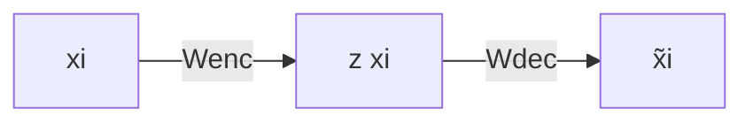

# Cours détaillé

## Introduction et Motivation

### Contexte général

La **PCA** (Analyse en Composantes Principales) est une méthode de **décomposition latente linéaire** qui permet d'identifier les **facteurs latents sous-jacents** structurant les données.

**Problématique principale :**

Les représentations de base des données ne sont pas toujours optimales. La PCA cherche à trouver une nouvelle représentation qui :

- Révèle les **facteurs latents** (cachés) qui gouvernent le processus
- Utilise la **corrélation statistique** pour identifier ces facteurs
- Permet une **simplification** des données par décimation justifiée

### Caractéristiques fondamentales

La PCA exhibe des **facteurs latents linéaires** et permet plusieurs interprétations complémentaires que nous étudierons.

📌 **Point clé :** La PCA fait partie de la famille des **modèles latents linéaires**

---

## Formalisation

### Maximisation de la variance

#### Intuition géométrique

**Question fondamentale :** Quelle information devons-nous préserver lors d'une projection ?

**Exemple illustratif :**

Supposons que les données $X \subset \Omega$ sont presque contenues dans un plan 2D au sein d'un espace 3D. Le choix pertinent consiste à sélectionner une base $\{u_1, u_2\}$ pour ce plan.

**Caractérisation de la base optimale $\{u_1, u_2, u_3\}$ :**

- Les données **varient le plus** le long des directions $u_1$ et $u_2$
- Les données **varient le moins** orthogonalement à ces directions (le long de $u_3$)

#### Formalisation mathématique

**Définitions :**

Soit $X$ l'ensemble de données, $\{u_i\}_{i \in [[D]]}$ une nouvelle **base orthonormale** de $\mathbb{R}^D$.

La **première composante principale** $u_1$ est choisie telle que la **variance des données projetées** sur $u_1$ soit maximale.

La composante $u_2$ est ensuite choisie en utilisant la projection sur $\text{Proj}_{u_1^{\perp}}(X)$ (orthogonal à $u_1$).

**Modèle mathématique :**

La moyenne empirique et la variance projetée sont :

$$x = \frac{1}{N} \sum_{i=1}^{N} x_i$$

$$v_{u_1} = \frac{1}{N} \sum_{i=1}^{N} (u_1^T x_i - u_1^T x)^2 = u_1^T \Sigma u_1$$

où $\Sigma = \frac{1}{N} \sum_{i=1}^{N} (x_i - x)(x_i - x)^T$ est la **matrice de covariance** des données.

**Problème d'optimisation :**

$$u_1 = \underset{u^T u = 1}{\arg\max} \, u^T \Sigma u$$

#### Résolution par les multiplicateurs de Lagrange

**Fonction de Lagrange :**

$$J(u) = u^T \Sigma u + \lambda(1 - u^T u)$$

**Conditions d'optimalité :**

$$\frac{\partial J(u)}{\partial u}\bigg|_{u=u_1} = 0 \quad \text{et} \quad \frac{\partial J(u)}{\partial \lambda}\bigg|_{\lambda=\lambda_1} = 0$$

**Résultat fondamental :**

$$\Sigma u_1 = \lambda_1 u_1 \quad \Rightarrow \quad v_{u_1} = u_1^T \Sigma u_1 = \lambda_1$$

✅ **Conclusion :** $(u_1, \lambda_1)$ est une **paire propre** (eigenpair) de la matrice de covariance $\Sigma$

#### Décomposition complète

En continuant ce processus de décimation, on obtient l'ensemble des **composantes principales** comme les paires propres $\{(u_i, \lambda_i)\}_{i \in [[D]]}$ de $\Sigma$.

**Décomposition matricielle :**

$$\Lambda = \begin{pmatrix} \lambda_1 & 0 & \cdots & 0 \\ 0 & \lambda_2 & \cdots & 0 \\ \vdots & \vdots & \ddots & \vdots \\ 0 & 0 & \cdots & \lambda_D \end{pmatrix} = \begin{pmatrix} | & | & & | \\ u_1 & u_2 & \cdots & u_D \\ | & | & & | \end{pmatrix}^T \Sigma \begin{pmatrix} | & | & & | \\ u_1 & u_2 & \cdots & u_D \\ | & | & & | \end{pmatrix} = U^T \Sigma U$$

---

### Minimisation de l'erreur

#### Équivalence variance-erreur

La variance $v_{u_1}$ s'exprime comme une somme de carrés :

$$v_{u_1} = \frac{1}{N} \sum_{i=1}^{N} (u_1^T (x_i - x))^2$$

**Raisonnement par le théorème de Pythagore :**

- Pour maximiser $v_{u_1}$, les termes $u_1^T(x_i - x)$ doivent être collectivement maximisés
- Puisque $(x_i - x)$ est fixé, cela équivaut à **minimiser la distance à l'axe de projection** (erreur d'approximation)

**Formulation alternative :**

$$u_1 = \underset{u^T u = 1}{\arg\min} \sum_{i=1}^{N} \|(x_i - x) - [u^T(x_i - x)]u\|_2^2 \quad \Rightarrow \quad \Sigma u_1 = \lambda_1 u_1$$

📌 **Équivalence fondamentale :**

**Maximiser la variance de projection ⇔ Minimiser l'erreur d'approximation**

#### Interprétation : Régression quadratique

✅ Une composante principale est une **régression quadratique** sur les données

#### Interprétation physique

Considérons un système physique $X$ avec des masses $m_i = 1$ aux positions $x_i$.

**Inertie du système :**

L'inertie par rapport à un point $a \in \Omega$ est :

$$I_a(X) = \sum_{i=1}^{N} d^2(a, x_i)$$

**Théorème de Huygens :**

Si $g = \frac{1}{N} \sum_{i=1}^{N} x_i$ (centre de gravité), alors :

$$I_a(X) = d^2(a, g) + I_g(X)$$

Cette relation est l'analogue physique de $\text{Var}(X) = \mathbb{E}[X^2] - (\mathbb{E}[X])^2$.

**Pour un sous-espace $F$ passant par $g$ :**

$$I_F(X) = \sum_{i=1}^{N} d^2(F, x_i) \quad \text{où} \quad d(F, x_i) = \|x_i - \text{Proj}_F(x_i)\|$$

✅ **Conclusion physique :** Une composante principale est un **sous-espace d'inertie minimale** par rapport à $X$

---

## Réduction de Dimension

### Structure de l'espace latent

#### Propriétés de l'espace latent

L'espace latent avec base $\{u_1, \ldots, u_D\}$ possède les propriétés suivantes :

**Ordre des valeurs propres :**

Par construction : $\lambda_1 > \lambda_2 > \cdots > \lambda_D$

**Variance totale :**

$$\lambda \stackrel{\text{def}}{=} \sum_{d=1}^{D} \lambda_d = \text{Tr}(\Sigma)$$

$\lambda$ représente la **variance totale** des données.

**Décorrélation des features latentes :**

$$v_{u_d} = \lambda_d \quad \text{et} \quad u_d^T u_{d'} = 0 \text{ pour } d \neq d'$$

$\Lambda$ est la **matrice de covariance diagonale** dans l'espace latent.

#### Coordonnées latentes

La base $\{u_1, \ldots, u_D\}$ induit des **coordonnées latentes** $y_i$ pour les données :

$$y_i(d) = \langle u_d, x_i - x \rangle = u_d^T (x_i - x)$$

En forme vectorielle :

$$y_i = U^T (x_i - x)$$

#### Transformation linéaire PCA

✅ La transformation PCA est **linéaire** et composée de trois étapes :

1. **Centrage** sur $x$
2. **Rotation** utilisant la matrice $U$
3. **Mise à l'échelle** (whitening) utilisant $\Lambda^{1/2}$

#### Modèle sous-jacent

**Préservation de la variance :**

L'espace latent préserve la variance des données centrées.

**Hypothèse de distribution :**

$$X_i \sim f_X = \mathcal{N}(x, \Sigma)$$

⚠️ **Limitation importante :** La PCA ne sera **pas pertinente pour des données non-gaussiennes** (par exemple, des données clusterisées)

#### Transformation exacte

📌 **Point crucial :** Jusqu'à présent, la PCA est une **transformation exacte**

$$y_i = U^T(x_i - x) \quad \text{donc} \quad U y_i = UU^T(x_i - x) = x_i - x$$

Car $U$ est orthogonale : $UU^T = I_D$

À ce stade, un objectif est d'étudier le **spectre** $\{\lambda_1 > \lambda_2 > \cdots > \lambda_D\}$ des données pour comprendre comment la variance est distribuée.

---

### Approximation de rang faible et réduction de dimension

#### Théorème d'Eckart et Young

**Théorème fondamental :**

Si $\Sigma = U\Lambda U^T$ et pour $K < D$, on définit :

$$\Sigma_K \stackrel{\text{def}}{=} \sum_{d=1}^{K} \lambda_d u_d u_d^T$$

Alors :

$$\underset{\text{rang}(S)=K}{\arg\min} \|\Sigma - S\|_F^2 = \Sigma_K$$

où $\|\cdot\|_F$ est la **norme de Frobenius**.

**Erreur d'approximation :**

$$\|\Sigma - \Sigma_K\|_F^2 = \sum_{d=K+1}^{D} \lambda_d$$

✅ $\Sigma_K$ est la **matrice de rang $K$ la plus proche** de $\Sigma$

#### Troncation pratique

**Troncation de $U$ et $\Lambda$ :**

$$\Sigma_K = \begin{pmatrix} | & & | \\ u_1 & \cdots & u_K \\ | & & | \end{pmatrix} \begin{pmatrix} \lambda_1 & & 0 \\ & \ddots & \\ 0 & & \lambda_K \end{pmatrix} \begin{pmatrix} | & & | \\ u_1 & \cdots & u_K \\ | & & | \end{pmatrix}^T = U_K \Lambda_K U_K^T$$

**Projection et reconstruction :**

- **Projection** (encodage) : $\tilde{y}_i = U_K^T x_i \in \mathbb{R}^K$
- **Reconstruction** (décodage) : $\tilde{x}_i = U_K U_K^T x_i + x$

📌 **Important :** On passe de $D$ dimensions à $K$ dimensions avec $K < D$

---

### Géométrie et qualité de reconstruction

#### Contribution relative à la variance

**Contribution de chaque dimension :**

$$c_d = \frac{\lambda_d}{\sum_k \lambda_k}$$

Cette métrique dépend de la **distribution du spectre** des valeurs propres.

#### Ratio de projection

**Ratio de projection d'une donnée $x_i$ sur un facteur latent :**

$$\rho_d(x_i) = \frac{\langle u_d, x_i \rangle^2}{\|x_i\|^2} = \cos^2(\angle(u_d, x_i))$$

**Interprétation :**

- Plus $\rho_d(x_i)$ est proche de 1, plus $x_i$ se situe sur l'axe $u_d$
- Ces métriques peuvent être **groupées** (sommées) pour évaluer la qualité par rapport à un sous-espace $\{u_1, u_2, \ldots\}$

#### Normalisation et mise à l'échelle

**Problème des échelles différentes :**

Chaque dimension originale possède sa propre unité (échelle), estimée par $\sigma_d^2$ (variance empirique le long de la dimension $d$).

⚠️ La PCA est plus efficace si **toutes les échelles sont similaires**

**Solution : Normalisation**

On crée la **matrice de mise à l'échelle** :

$$S = \text{diag}[\sigma_1^2, \ldots, \sigma_D^2]$$

On définit la **métrique de Mahalanobis** :

$$d_S^2(x, y) = (x - y)^T S^{-1} (x - y)$$

Dans cet espace métrique, la matrice de covariance $\Sigma_S$ est aussi normalisée (elle devient la **matrice de corrélation**) et utilisée comme base pour la PCA.

💡 **Astuce pratique :** Normaliser les données avant PCA améliore souvent les résultats

---

## Application pratique de la PCA

### Algorithme PCA complet

**Étapes d'application :**

Soit $X \in \Omega$ l'ensemble de données :

1. **Calculer** la moyenne empirique $x = \frac{1}{N} \sum_{i=1}^{N} x_i$

2. **Centrer** les données : $x_i \leftarrow (x_i - x)$ et former la matrice centrée $X$

3. **Calculer** la matrice de covariance : $\Sigma = \frac{1}{N} XX^T$

4. **Décomposer** en valeurs propres : $\Sigma = U\Lambda U^T$

📌 Jusqu'ici : transformation **exacte**

5. **Sélectionner** le nombre de composantes $K$

6. **Définir** $U_K$, $\Lambda_K$ et calculer $\{\tilde{y}_i\}_{i \in [[N]]}$ et/ou $\{\tilde{x}_i\}_{i \in [[N]]}$

### Choix du nombre de composantes $K$

**Trois stratégies principales :**

**Stratégie 1 : Dimension cible**

$$K = d$$

où $d$ est la dimension souhaitée, ce qui donne $\tilde{y}_i \in \mathbb{R}^d$

**Stratégie 2 : Seuil de variance**

Exiger que l'espace latent conserve une proportion $\tau$ de la variance totale :

$$\text{Var}(Y) = \tau \cdot \text{Var}(X) \quad \Rightarrow \quad K \text{ tel que } \frac{\sum_{d=1}^{K} \lambda_d}{\sum_{d=1}^{D} \lambda_d} > \tau$$

**Exemple :** $\tau = 0.95$ signifie conserver 95% de la variance

**Stratégie 3 : Erreur de reconstruction**

Entraîner $K$ tel que $L(X) \leq \epsilon$, où par exemple :

$$L(X) = \sum_i \|x_i - \tilde{x}_i\|^2$$

💡 **Conseil pratique :** Visualiser le spectre des valeurs propres (scree plot) aide à identifier un "coude" naturel

---

## Alternatives et extensions

### AutoEncodeurs linéaires (Linear AE)

**Structure d'un AutoEncodeur linéaire :**

- $W_{\text{enc}}$ et $W_{\text{dec}}$ : matrices de poids (encoder et decoder)
- $z(x_i) = W_{\text{enc}} x_i$ : encodage
- $\tilde{x}_i = W_{\text{dec}} z(x_i)$ : décodage

**Problème d'optimisation :**

$$\theta^* = \underset{W_1, W_2}{\arg\min} \sum_{i=1}^{N} \frac{1}{2} \sum_{d=1}^{D} (x_i[d] - \tilde{x}_i[d])^2 = \underset{\text{rang}(W)=K}{\arg\min} \|X - WZ\|_F^2$$

### Relation entre PCA et AutoEncodeur linéaire

**Décomposition SVD :**

En utilisant le théorème d'Eckart et Young avec $X = U\Psi V^T$, la solution est :

$$W_{\text{dec}} Z = U_K \Psi_K V_K^T$$

**Solution optimale :**

En posant $W_{\text{dec}} = U_K \Psi_K$, alors :

$$W_{\text{enc}} = \Psi_K^{-1} U_K^T$$

Reconstruction :

$$\tilde{x}_i = U_K U_K^T x_i$$

**Relation mathématique :**

Pour des données **centrées** :

- **PCA :** $\Sigma = \frac{1}{N} XX^T = U\Lambda U^T$ donc $\tilde{x}_i = U_K U_K^T x_i$

- **AE :** $X = U\Psi V^T$ donc $\Sigma = \frac{1}{N} U\Psi^2 U^T$ et $\tilde{x}_i = U_K U_K^T x_i$

Relation entre valeurs propres :

$$\Lambda = \frac{1}{N} \Psi^2 \quad \Rightarrow \quad \text{PCA}(X) \leftrightarrow \text{AE}\left(\sqrt{\frac{1}{N}} X\right)$$

✅ **Conclusion fondamentale :** Un AutoEncodeur linéaire effectue une PCA si les données sont **centrées et normalisées**

⚠️ **Note :** $W_{\text{enc}}$ n'est **pas l'inverse** de $W_{\text{dec}}$ si $K < D$

### Extensions des AutoEncodeurs

**AutoEncodeurs non-linéaires :**

En ajoutant des couches cachées avec fonctions d'activation non-linéaires, l'espace latent devient **non-linéaire**.

**Variational AutoEncoders (VAE) :**

En changeant la fonction de perte (utilisation de l'ELBO - Evidence Lower BOund), on peut imposer de la **parcimonie** (sparsity) dans l'espace latent.

---

### Formulations alternatives de la PCA

#### PCA Probabiliste

**Reformulation avec distribution latente explicite :**

- Distribution latente : $\mathbb{P}(z) = \mathcal{N}(0, I_{dK})$
- Modèle conditionnel : $\mathbb{P}(x|z) = \mathcal{N}(Wz + \mu, \sigma^2 I_{dD})$

**Avantages :**

- Accommodation du **bruit de mesure** (variance $\sigma^2$)
- Mode **génératif** : possibilité de générer de nouvelles données
- Estimation des paramètres par **Maximum de Vraisemblance**
- Algorithme **EM** (Expectation-Maximization) pour économiser les calculs
- **Bayesian PCA** : inversion du conditionnel pour trouver $K$ par entraînement

#### Kernel PCA

**Principe :**

Utilisation d'un **mapping non-linéaire** $\phi(x_i)$ via une fonction noyau :

$$k(x_i, x_j) = \phi(x_i)^T \phi(x_j)$$

Permet d'effectuer la PCA dans un **espace plus favorable** (possiblement de dimension infinie) sans calculer explicitement $\phi$.

#### Local PCA

Effectue la PCA sur des **voisinages locaux** des données pour considérer uniquement la **dimensionnalité intrinsèque locale**.

Utile pour des données avec structure locale complexe (variétés non-linéaires).

#### Limitation computationnelle

⚠️ **Complexité :** La limitation principale de la PCA classique est la **décomposition en valeurs propres** de $\Sigma$ en $O(D^3)$

Pour de très grandes dimensions, des méthodes alternatives ou approximatives peuvent être nécessaires.

---

## Synthèse et points clés

### Caractéristiques essentielles de la PCA

**Nature du modèle :**

- La PCA fait partie des **modèles latents linéaires**
- S'applique sur **données centrées**
- Utilise la **variance** comme critère de décomposition

**Propriétés mathématiques :**

- Décomposition **exacte et complète** en composantes **décorrélées**
- Suppose une **distribution normale** des données
- Peut être formulée comme une **régression**

**Applications :**

- Stratégie de **décimation justifiée** basée sur l'approximation de rang faible
- Utile pour le **débruitage** via un modèle de bruit gaussien

**Équivalences :**

- Équivalent à un **AutoEncodeur linéaire**
- Peut recevoir une **formulation stochastique**
- Généralisable au cas **non-linéaire via des noyaux**

### Quand utiliser la PCA ?

✅ **Adapté pour :**

- Données suivant approximativement une distribution gaussienne
- Réduction de dimension avec préservation de variance
- Visualisation de données haute dimension
- Débruitage de données corrompues par bruit gaussien
- Compression de données

❌ **Non adapté pour :**

- Données fortement clusterisées (non-gaussiennes)
- Données où les relations sont fortement non-linéaires
- Cas où la variance n'est pas un bon critère d'information

### Concepts mathématiques à maîtriser

📌 Pour bien comprendre la PCA, il faut maîtriser :

- **Transformation linéaire** et **matrice orthogonale**
- **Coordonnées** et **rang** matriciel
- **Moyenne** et **variance**
- **Projection** orthogonale
- **Décomposition en valeurs propres** (eigendecomposition)
- **Trace** d'une matrice
- **Norme de Frobenius**
- **Multiplicateurs de Lagrange**

---

## Questions d'examen types

### Questions conceptuelles

1. Expliquer comment la PCA utilise la variance comme critère

2. Montrer que maximisation de variance ≡ minimisation d'erreur

3. Montrer comment la PCA utilise le théorème d'Eckart-Young

4. Peut-on appliquer la PCA sur n'importe quelles données ?

5. Est-il pertinent d'appliquer la PCA sur n'importe quelles données ?

6. Comment appliquer la PCA sur des données clusterisées ?

### Questions techniques

**Étant donné des données :**

- Comment appliquez-vous la PCA ?
- Quelle information la PCA vous fournit-elle ?
- Comment reconstruire les données avec $K < D$ composantes ?
- Comment sélectionner les composantes à conserver ?

### Démonstrations mathématiques

- Montrer que la PCA est équivalente à un AutoEncodeur linéaire
- Démontrer l'équivalence variance maximale / erreur minimale
- Prouver que les composantes principales sont les vecteurs propres de $\Sigma$