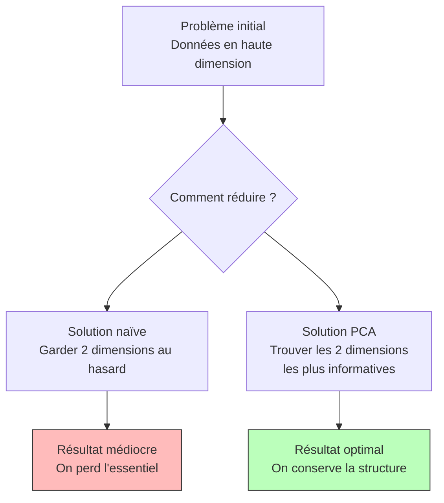
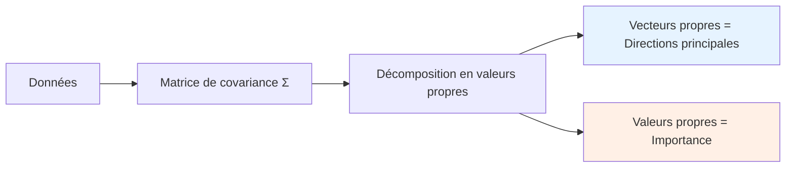

# Analyse en Composantes Principales (PCA) - Support de révision oral

## 1. L'histoire derrière la PCA : Le problème de la vision

Imaginez que vous êtes un astronome du 19e siècle. Vous observez des étoiles et notez leur position sur 50 mesures différentes (température, luminosité, taille, etc.). Problème : **comment visualiser ces étoiles en 2D sur une carte tout en conservant l'information la plus importante ?**

C'est exactement ce que résout la PCA : trouver **le meilleur plan de projection** pour voir l'essentiel.

::: {.callout-important}
**Concept Clé : La magie du changement de point de vue**
La PCA ne crée pas d'information nouvelle. Elle **réorganise** l'information existante en mettant en avant ce qui varie le plus. C'est comme regarder un tableau sous un angle qui fait ressortir les contrastes.
:::

## 2. L'intuition géométrique : Le nuage de points

### La vision en 3D
Imaginez un nuage de points en 3D (comme des moucherons dans une pièce). Si vous deviez les écraser sur un mur :
- Quel mur choisiriez-vous pour que les moucherons soient **le plus étalés** ?
- Ce mur, c'est le **plan principal**.
- La ligne dans ce mur où ils sont le plus alignés, c'est la **première composante**.

::: {.callout-tip}
**Idée Essentielle : La PCA trouve les "os" du nuage**
Comme un radiologue qui voit les os à travers la peau, la PCA trouve la **structure squelettique** des données.
:::

## 3. Les deux manières équivalentes de comprendre

### Version A : Maximiser l'étalement (la variance)
**Question :** Quelle droite dans l'espace maximise la dispersion des points projetés ?

**Réponse :** La droite qui passe par le centre (moyenne) et pointe dans la direction où les points s'étirent le plus.

### Version B : Minimiser l'erreur
**Question :** Quelle droite minimise la distance totale des points à la droite ?

**Surprise mathématique :** Ces deux problèmes donnent **exactement la même solution** !

::: {.callout-note}
**Pourquoi c'est magique ?**
Grâce au théorème de Pythagore ! Maximiser la projection revient à minimiser la distance perpendiculaire. C'est comme optimiser un élastique : plus vous l'étirez dans une direction, moins il reste de longueur dans l'autre.
:::

## 4. Le coup de génie : Les vecteurs propres comme solution

### Le "aha!" moment
Après calcul (multiplicateurs de Lagrange), on découvre que :
- Les directions optimales sont les **vecteurs propres** de la matrice de covariance
- Leur importance est donnée par les **valeurs propres**

**Analogie :** Pensez à un tremblement de terre :
- Les vecteurs propres sont les directions où le sol bouge le plus
- Les valeurs propres sont l'amplitude du mouvement

## 5. En pratique : La recette en 4 étapes

### Étape 1 : Centrer (toujours !)
Soustraire la moyenne de chaque variable. Pourquoi ? Sinon, la première composante pourrait simplement pointer vers le centre de masse.

### Étape 2 : Calculer comment les variables dansent ensemble
La matrice de covariance Σ mesure : "Quand cette variable monte, est-ce que l'autre monte aussi ?"

### Étape 3 : Trouver les directions de danse principales
Décomposition en valeurs propres → donne les axes et leur importance.

### Étape 4 : Choisir et projeter
Garder les K premiers axes, projeter les données.

::: {.callout-warning}
**Piège à éviter : L'échelle qui trompe**
Si une variable est en mètres et l'autre en millimètres, cette dernière semblera plus importante. **Solution :** Standardiser (centrer-réduire) avant PCA.
:::

## 6. L'art de choisir K : Combien de composantes garder ?

### Le scree plot : Votre meilleur ami
Tracez les valeurs propres en ordre décroissant. Cherchez le "coude" :
- Avant le coude : dimensions importantes
- Après le coude : bruit, détails insignifiants

### Trois règles simples
1. **Règle du 95%** : Garder assez de composantes pour expliquer 95% de la variance
2. **Règle du coude** : S'arrêter où la courbe s'aplatit
3. **Contrainte pratique** : K=2 ou 3 pour la visualisation

## 7. Ce que la PCA vous dit (et ce qu'elle ne dit pas)

### Ce qu'elle vous dit ✅
- La **structure linéaire** des données
- Les **directions principales** de variation
- La **dimension intrinsèque** (combien de dimensions vraiment utiles)
- Quelles **variables** contribuent à chaque axe

### Ce qu'elle ne vous dit pas ❌
- **Pas un clustering** : Elle ne trouve pas des groupes
- **Linéaire uniquement** : Elle rate les relations courbes
- **Sensible aux outliers** : Un point extrême peut tout faire basculer

## 8. Quand la PCA échoue (et quoi faire à la place)

| Situation problème | Pourquoi PCA échoue | Alternative |
|-------------------|---------------------|-------------|
| Données en groupes (clusters) | PCA cherche des directions, pas des groupes | t-SNE, UMAP, clustering |
| Relations non-linéaires | Ne voit que les relations droites | Kernel PCA, Autoencodeurs |
| Données avec beaucoup de bruit | Le bruit apparaît comme variance | PCA robuste, débruitage préalable |

## 9. La connexion surprise : PCA = Autoencodeur linéaire

**Découverte fascinante :** Un autoencodeur linéaire (sans fonctions d'activation) fait exactement la même chose qu'une PCA !

**Pourquoi c'est profond ?** Cela relie la PCA (statistique années 1900) aux réseaux de neurones (IA moderne).

## 10. Les extensions avancées

### Kernel PCA : Pour les relations courbes
Astuce mathématique : transformer les données dans un espace de plus haute dimension où elles deviennent linéaires, y faire une PCA, puis revenir.

### PCA probabiliste : Pour les incertains
Version bayésienne qui gère l'incertitude et peut déterminer K automatiquement.

### PCA incrémentale : Pour les flux de données
PCA qui s'adapte en temps réel quand de nouvelles données arrivent.

## 11. Fiche de révision ultra-condensée

::: {.callout-important}
**En 30 secondes :**

1. **PCA = changement de base intelligent**
2. **Nouveaux axes = directions de variance maximale**
3. **Valeurs propres = importance de chaque axe**
4. **Toujours centrer d'abord !**
5. **Choisir K avec le scree plot**
6. **Utile pour : visualisation, réduction dimension, débruitage**
7. **Pas utile pour : clustering, relations non-linéaires**
:::

## 12. Pour l'oral : Les 3 histoires à raconter

### Histoire 1 : L'astronome et les étoiles
"Imaginez vouloir cartographier les étoiles avec 50 mesures chacune. La PCA trouve le meilleur plan pour cette carte..."

### Histoire 2 : Le nuage de moucherons
"Des moucherons dans une pièce 3D. Quel mur choisir pour les écraser en gardant le maximum d'information ?"

### Histoire 3 : La valise intelligente
"Faire sa valise, c'est choisir quoi emporter. La PCA, c'est l'art mathématique de faire sa valise de données..."

## 13. Questions pièges et comment y répondre

**Q : "Pourquoi centrer les données ?"**
R : "Sinon, la première composante pointerait juste vers la moyenne, ce qui n'est pas informatif."

**Q : "PCA vs clustering ?"**
R : "PCA réduit la dimension, clustering trouve des groupes. PCA peut aider avant un clustering, mais ne clusterise pas."

**Q : "Comment interpréter les coefficients ?"**
R : "Un coefficient élevé sur un axe signifie que cette variable contribue fortement à cet axe."

## 14. En résumé : La PCA, c'est...

**L'art de voir l'essentiel dans la complexité.** Une méthode centenaire toujours pertinente, qui relie statistique classique et apprentissage moderne. Un outil fondamental dans la boîte à outils de tout data scientist.

**Pour finir :** La PCA ne vous dit pas ce qui est important dans vos données, elle vous dit **où chercher** l'important.