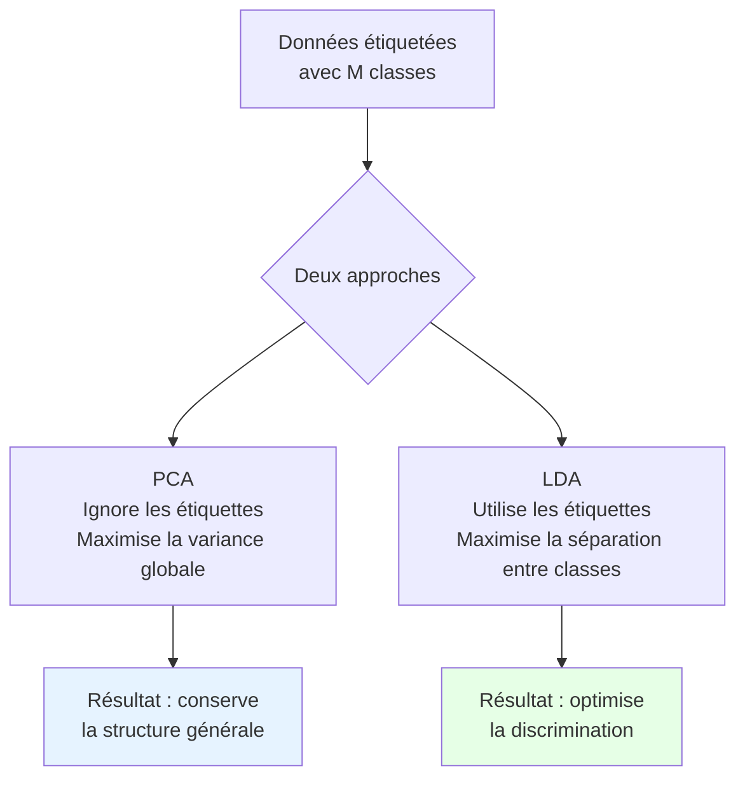
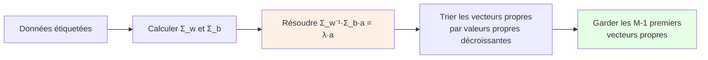
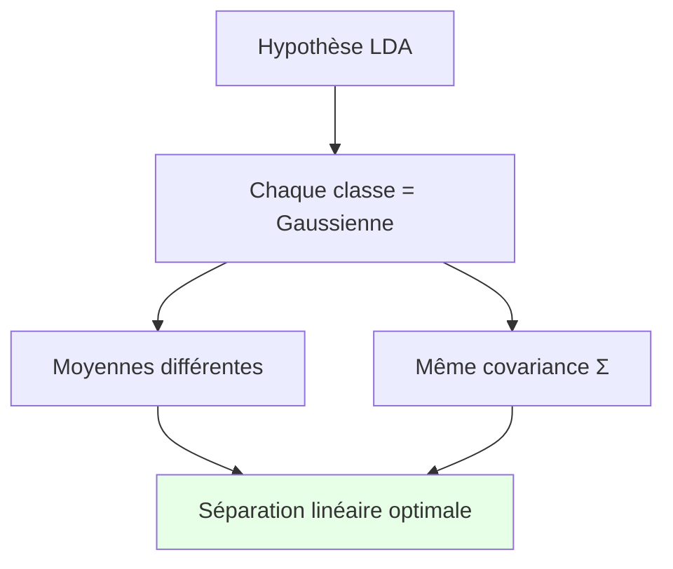
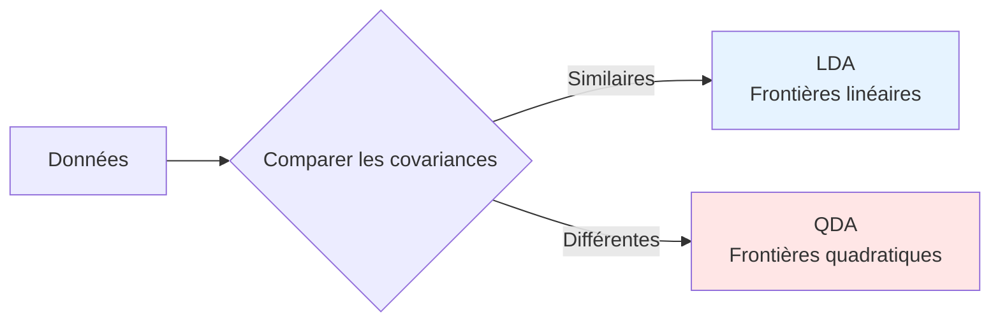

# Analyse Discriminante Linéaire (LDA) - Support de révision oral

## 1. L'histoire derrière la LDA : Le problème du tri intelligent

Imaginez que vous travaillez dans un centre de tri postal. Vous avez des lettres avec 100 mesures différentes (poids, taille, couleur, texture...). Vous devez les trier automatiquement par type (lettre, colis, magazine). Comment trouver **la ou les dimensions qui séparent le mieux les catégories** ?

C'est exactement ce que résout la LDA : trouver **les axes qui maximisent la séparation entre classes** tout en minimisant la dispersion à l'intérieur de chaque classe.

::: {.callout-important}
**Concept Clé : La différence fondamentale avec la PCA**
La PCA regarde **toutes** les données et cherche les directions de variation maximale. La LDA regarde d'abord **les étiquettes** (les classes) et cherche les directions qui séparent le mieux ces classes.
:::



## 2. L'intuition géométrique : Séparer des nuages de points colorés

### La vision en 2D
Imaginez des points de deux couleurs (rouge et bleu) dispersés sur un plan. Vous ne pouvez regarder que selon une seule direction (comme une lampe torche qui éclaire une ligne).

**Question :** Comment orienter la lampe pour que, sur cette ligne, les points rouges et bleus soient **le plus séparés possible** ?

La LDA trouve cette direction optimale.

::: {.callout-tip}
**Idée Essentielle : La LDA cherche la "ligne de démarcation"**
Comme un arbitre qui trace une ligne entre deux équipes, la LDA trouve la direction qui sépare le mieux les groupes, tout en s'assurant que chaque équipe est regroupée.
:::

## 3. Les deux objectifs en tension

### Objectif 1 : Éloigner les centres (Between-class)
**"Mettre les moyennes le plus loin possible"**  
Si vous projetez les points sur une droite, vous voulez que les centres (moyennes) de chaque classe soient **le plus éloignés possible**.

### Objectif 2 : Regrouper chaque classe (Within-class)
**"Garder chaque classe compacte"**  
Vous voulez aussi que les points d'une même classe soient **le plus regroupés possible** après projection.

::: {.callout-note}
**Le dilemme :** Parfois, étirer les centres les éloigne, mais cela peut aussi étirer les classes. Il faut trouver le bon compromis.
**Solution de Fisher :** Maximiser le ratio : (distance entre centres)² / (dispersion totale dans les classes)
:::

## 4. Le critère de Fisher : Le compromis mathématique

### La formule magique
Pour une direction **a**, on calcule :

```
Score(a) = (Éloignement des centres)² / (Dispersion dans les classes)
```

Mathématiquement :
```
J(a) = (aᵀ·Σ_b·a) / (aᵀ·Σ_w·a)
```

Où :
- **Σ_b** = matrice de covariance "entre classes" (between) → mesure l'éloignement des centres
- **Σ_w** = matrice de covariance "dans les classes" (within) → mesure la dispersion interne

::: {.callout-tip}
**Astuce mnémotechnique :**
- **B** comme **Between** = **B** pour "Bien séparer" (les centres)
- **W** comme **Within** = **W** pour "Regrouper" (chaque classe)
:::

## 5. La solution élégante : Un problème aux valeurs propres

### Le "aha!" moment
En cherchant le maximum du ratio, on tombe sur l'équation :

```
Σ_b·a = λ·Σ_w·a
```

C'est un **problème aux valeurs propres généralisé** !

**Solution :** La direction optimale **a** est le premier vecteur propre de `Σ_w⁻¹·Σ_b`.



## 6. La limitation dimensionnelle surprenante

### Pourquoi seulement M-1 dimensions ?
Avec M classes, la LDA ne peut trouver que **M-1** directions discriminantes non nulles.

**Analogie :** Avec 3 points (3 classes), vous pouvez au plus les placer dans un plan (2D). Avec 2 points (2 classes), vous pouvez au plus les placer sur une ligne (1D).

::: {.callout-warning}
**Piège à éviter :** Si vous avez plus de dimensions que M-1, les directions supplémentaires auront une valeur propre nulle → pas discriminantes.
:::

## 7. En pratique : La recette LDA

### Étape 1 : Préparer les données
- Vérifier que chaque classe a assez d'exemples (au moins D+1 pour éviter Σ_w singulière)
- Optionnel : standardiser si les échelles sont très différentes

### Étape 2 : Calculer les matrices clés
1. **Σ_w** (within) : moyenne des covariances de chaque classe
2. **Σ_b** (between) : covariance des centres de classes

### Étape 3 : Résoudre le problème aux valeurs propres
Calculer les vecteurs propres de `Σ_w⁻¹·Σ_b`

### Étape 4 : Garder les M-1 premières directions
Trier par valeurs propres décroissantes, garder les plus importantes

### Étape 5 : Projeter et classifier
- Projeter les données sur le sous-espace discriminant
- Classifier (par exemple avec une règle du plus proche voisin)

## 8. LDA comme classifieur : L'hypothèse gaussienne

### La modélisation probabiliste
La LDA suppose que **chaque classe suit une distribution gaussienne** avec :
- Moyenne différente pour chaque classe
- **Même matrice de covariance** pour toutes les classes (c'est crucial !)



### La frontière de décision
Avec cette hypothèse, la frontière entre deux classes est **linéaire** (d'où le "L" de LDA).

**Pourquoi ?** Les contours d'égal densité de deux gaussiennes avec même covariance sont des hyperplans.

## 9. Quand la LDA fonctionne bien (et moins bien)

### Conditions idéales ✅
- Les classes sont **approximativement gaussiennes**
- Les covariances des classes sont **similaires**
- Assez d'exemples par classe (au moins 10× le nombre de dimensions)
- Relations **linéaires** entre variables

### Situations problématiques ❌
- **Covariances très différentes** → utiliser QDA (Quadratic Discriminant Analysis)
- **Relations non-linéaires** → Kernel LDA ou méthodes non-linéaires
- **Peu d'exemples** par rapport aux dimensions → régulariser ou réduire dimension d'abord
- **Classes non-gaussiennes** → autres classifieurs (forêts aléatoires, SVM...)

## 10. LDA vs QDA : Le dilemme linéaire vs quadratique

### La différence cruciale
- **LDA** : Suppose **même covariance** pour toutes classes → frontières linéaires
- **QDA** : Suppose **covariances différentes** → frontières quadratiques



**Règle pratique :** Si vous avez peu de données, LDA est plus robuste (moins de paramètres à estimer).

## 11. LDA dans le monde réel : L'exemple des visages

### Reconnaissance faciale avec LDA (Fisherfaces)
Contrairement aux Eigenfaces (PCA), les Fisherfaces (LDA) :
1. **PCA d'abord** : Réduire la dimension pour éviter les problèmes numériques
2. **LDA ensuite** : Trouver les directions qui séparent les personnes

**Résultat :** Meilleure performance pour distinguer différentes personnes, car on ignore les variations d'éclairage, pose, etc. (qui sont communes à toutes les classes).

## 12. Fiche de révision ultra-condensée

::: {.callout-important}
**En 30 secondes :**

1. **LDA = réduction supervisée** (utilise les étiquettes)
2. **Maximise** (distance entre centres) / (dispersion dans classes)
3. **Solution** = vecteurs propres de Σ_w⁻¹·Σ_b
4. **Au plus M-1** dimensions discriminantes
5. **Suppose** : classes gaussiennes, mêmes covariances
6. **Utile pour** : classification, visualisation supervisée
7. **Alternative** : QDA si covariances différentes
:::

## 13. Pour l'oral : Les 3 histoires à raconter

### Histoire 1 : Le tri postal
"Imaginez trier automatiquement du courrier. La LDA trouve comment regarder les lettres pour mieux distinguer les types..."

### Histoire 2 : L'arbitre sportif
"Comme un arbitre qui trace une ligne au milieu du terrain, la LDA trace la frontière optimale entre équipes..."

### Histoire 3 : Les jumeaux statistiques
"La LDA suppose que toutes les classes sont comme des jumeaux : même forme (covariance), mais placés à des endroits différents (moyennes)..."

## 14. Questions pièges et comment y répondre

**Q : "Pourquoi M-1 dimensions maximum ?"**
R : "Avec M points (les centres), vous pouvez au plus les placer dans un espace de dimension M-1. Plus de dimensions seraient redondantes."

**Q : "LDA vs PCA pour la visualisation ?"**
R : "PCA montre la structure globale, LDA montre la séparation entre classes. Pour explorer les données, PCA. Pour visualiser la discrimination, LDA."

**Q : "Quand LDA échoue-t-elle ?"**
R : "Quand les classes n'ont pas la même forme (covariance différente), ou quand leurs frontières sont courbes."

## 15. L'astuce mnémotechnique finale

**FLDR** = **F**isher's **L**inear **D**iscriminant **R**atio
```
J(a) = (distance entre centres)² / (dispersion dans classes)
```

**B** et **W** :
- **B** pour **B**etween = **B**ien séparer
- **W** pour **W**ithin = **W**ell grouped (bien regroupé)

## 16. En résumé : La LDA, c'est...

**L'art de trouver la perspective qui sépare le mieux les catégories.** Une méthode élégante qui transforme un problème de classification en un problème géométrique d'optimisation de projection.

**Pour finir :** La LDA ne vous dit pas si vos classes sont séparables, elle vous donne **la meilleure chance** de les séparer linéairement.