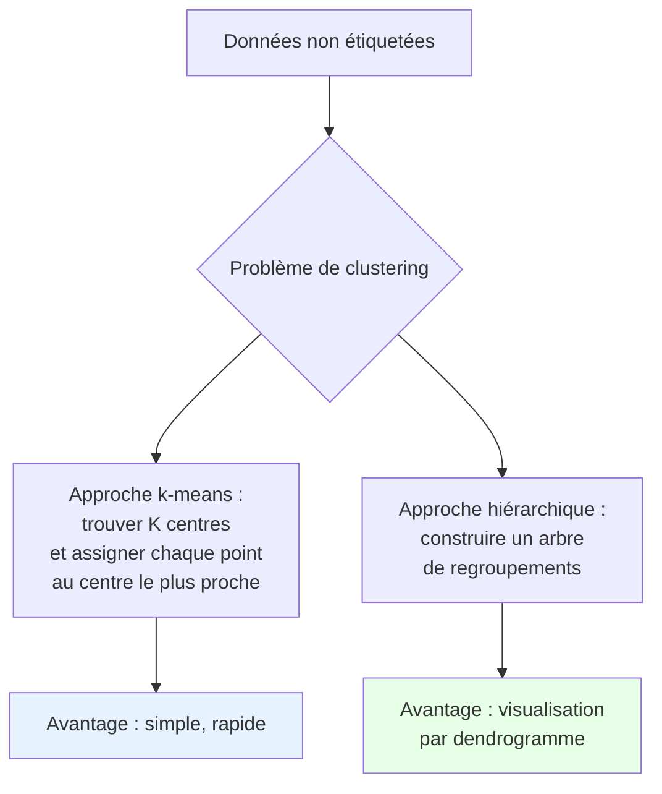
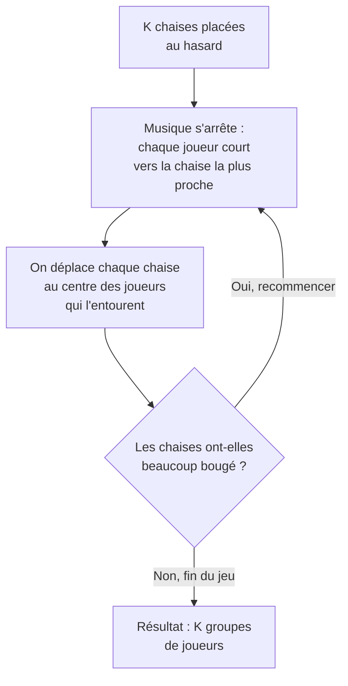

# Intuition

## 1. Le Problème Fondamental : Regrouper sans Guide

**Imaginez :** On vous donne 1000 photos d'animaux non étiquetées et on vous demande : "Combien y a-t-il de types d'animaux différents, et quelles photos vont ensemble ?" C'est exactement le problème du clustering !

**K-means** répond à cette question en faisant **une hypothèse simplificatrice** : chaque type d'animal peut être représenté par une **image moyenne** (prototype), et chaque photo est proche de l'un de ces prototypes.

::: {.callout-important}
**Concept Clé : Apprentissage non supervisé**
Le clustering est **non supervisé** : pas d'étiquettes, pas de professeur pour dire "ceci est un chat". L'algorithme doit découvrir la structure par lui-même.
:::



## 2. L'Intuition Géométrique : Le Jeu des Chaises Musicales

**Analogie :** Imaginez un jeu de chaises musicales avec K chaises (clusters) et N joueurs (points de données). Quand la musique s'arrête :
1. Chaque joueur court vers la chaise la plus proche **(assignation)**
2. On déplace chaque chaise au centre des joueurs qui l'entourent **(mise à jour)**
3. On recommence jusqu'à ce que les chaises ne bougent plus

**C'est exactement k-means !**



## 3. La Formulation Mathématique : Minimiser l'Énergie

### Le Critère à Minimiser
K-means cherche à minimiser :
```
L = somme sur tous les points de (distance au centre de son cluster)²
```

**Pourquoi au carré ?** Deux raisons :
1. **Mathématique** : rend le problème plus facile à résoudre
2. **Géométrique** : pénalise plus les points très éloignés

### Les Deux Équations Magiques

**Étape d'assignation (E-like) :**
Pour chaque point `x_i`, trouver le centre `μ_k` le plus proche :
```
Assigner x_i au cluster k qui minimise ||x_i - μ_k||²
```

**Étape de mise à jour (M-like) :**
Pour chaque cluster `k`, recalculer son centre :
```
μ_k = moyenne de tous les points assignés au cluster k
```

::: {.callout-note}
**Pourquoi ça converge ?**
Chaque étape ne peut qu'améliorer (ou laisser inchangé) le critère. Comme il y a un nombre fini d'assignations possibles, l'algorithme doit terminer.
:::

## 4. Le Problème de l'Initialisation : Où Placer les Premières Chaises ?

### Le Dilemme
Si toutes les chaises commencent dans le même coin, le jeu sera très long et donnera un mauvais résultat. **K-means est très sensible à l'initialisation !**

```mermaid
flowchart TD
    A[Choix d'initialisation] --> B[Mauvaise initialisation]
    A --> C[Bonne initialisation]
    B --> D[Convergence lente<br/>Clusters de mauvaise qualité<br/>Maximum local]
    C --> E[Convergence rapide<br/>Clusters de bonne qualité<br/>Maximum global (ou bon)]
    
    style D fill:#ffcccc
    style E fill:#ccffcc
```

### K-means++ : La Solution Intelligente
**Principe :** Éloigner les centres initiaux les uns des autres.

**Algorithme :**
1. Choisir un premier centre au hasard
2. Pour chaque point, calculer sa distance `D(x)` au centre le plus proche
3. Choisir le prochain centre avec une probabilité proportionnelle à `D(x)²`
4. Répéter jusqu'à avoir K centres

**Pourquoi ça marche ?** En favorisant les points éloignés, on couvre mieux l'espace des données.

::: {.callout-tip}
**Astuce pratique :** Toujours utiliser k-means++ ou lancer k-means plusieurs fois avec différentes initialisations aléatoires et garder le meilleur résultat.
:::

## 5. Le Choix de K : Combien de Chaises ?

### Le Problème Principal
K-means a besoin qu'on lui dise combien de clusters chercher. Mais dans la vraie vie, **on ne sait pas à l'avance** !

### Méthodes pour Choisir K

#### 1. Méthode du Coude (Elbow Method)
**Principe :** Tracer l'erreur (inertie) en fonction de K.
```
Erreur(K) = somme des distances² des points à leur centre
```
Quand K augmente, l'erreur diminue. On cherche le "coude" où l'amélioration ralentit.

#### 2. Score de Silhouette
**Principe :** Mesure combien un point est bien dans son cluster vs hors de son cluster.
```
s(i) = (b(i) - a(i)) / max(a(i), b(i))
```
où `a(i)` = distance moyenne aux autres points du même cluster,  
`b(i)` = distance moyenne aux points du cluster le plus proche.

**Interprétation :** `s(i) ≈ 1` = bien classé, `≈ 0` = à la frontière, `≈ -1` = mal classé.

#### 3. Règle Pratique
Pour N points : `K ≈ √(N/2)` (très grossier, à utiliser avec prudence).

## 6. K-means vs GMM : Le Duel des Clusters

| Aspect | K-means | GMM avec EM |
|--------|---------|-------------|
| **Philosophie** | Géométrique (distance) | Probabiliste (densité) |
| **Appartenance** | Dure (0 ou 1) | Douce (probabilité) |
| **Forme clusters** | Sphères (toutes mêmes tailles) | Ellipses (tailles/orientations variables) |
| **Modèle** | Minimise distance | Maximise vraisemblance |
| **Vitesse** | Rapide (O(NKT)) | Plus lent (plus de calculs) |
| **Cas limite** | - | K-means = GMM avec σ→0 et covariances sphériques |

::: {.callout-important}
**K-means est un cas particulier de GMM !**
Quand on prend un mélange de gaussiennes avec :
- Covariances sphériques et identiques : `Σ_k = σ²I`
- Et qu'on fait tendre `σ → 0`
Alors l'assignation douce devient dure, et on retrouve k-means.
:::

## 7. Les Pièges de K-means et Comment les Éviter

### Piège 1 : Les Clusters Non Sphériques
**Problème :** K-means suppose des clusters sphériques. S'ils sont allongés ou de formes bizarres, ça échoue.

**Solution :** 
- Standardiser les données (centrer-réduire)
- Utiliser une autre méthode (GMM, spectral clustering)
- Transformer les données (PCA d'abord)

### Piège 2 : Les Clusters de Tailles Très Différentes
**Problème :** K-means tend à créer des clusters de taille similaire, même si la réalité est différente.

**Solution :** Ajuster K, ou utiliser une méthode qui gère ça (GMM).

### Piège 3 : La Sensibilité aux Outliers
**Problème :** Un point très éloigné tire le centre de son cluster vers lui.

**Solution :**
- Détecter et enlever les outliers avant
- Utiliser k-medoids (plus robuste)
- Standardiser pour réduire l'influence

### Piège 4 : L'Interprétation des Résultats
**Problème :** K-means trouve toujours K clusters, même si les données n'ont pas de structure.

**Solution :** Toujours valider avec des méthodes objectives (silhouette, gap statistic).

## 8. En Pratique : La Recette Complète

### Étape 1 : Préparation des Données
1. **Nettoyer** : gérer les valeurs manquantes
2. **Standardiser** : centrer et réduire chaque variable
3. **Visualiser** (si possible en 2D/3D) pour avoir une idée

### Étape 2 : Choix de K
1. **Méthode du coude** : tracer inertie vs K
2. **Score de silhouette** : moyenne sur tous les points
3. **Connaissance du domaine** : parfois on sait combien de clusters on cherche

### Étape 3 : Exécution
```python
# Pseudocode
1. Initialiser K centres avec k-means++
2. Répéter:
   a. Assigner chaque point au centre le plus proche
   b. Recalculer les centres comme moyennes
   c. Si les centres bougent peu, arrêter
3. Évaluer avec score de silhouette
4. Si doute, relancer avec différentes initialisations
```

### Étape 4 : Validation
1. **Interne** : scores (silhouette, Davies-Bouldin)
2. **Externe** : si on a quelques étiquettes, comparer
3. **Manuelle** : visualisation, bon sens

## 9. Les Variantes de K-means

### K-medoids
**Différence** : Les centres sont des points réels des données (pas des moyennes).

**Avantage** : Plus robuste aux outliers, fonctionne avec n'importe quelle distance.

### Mini-batch K-means
**Différence** : Utilise des sous-échantillons des données à chaque itération.

**Avantage** : Beaucoup plus rapide pour les grandes données.

### Fuzzy C-means
**Différence** : Assignation douce (comme GMM) mais avec un critère géométrique.

**Avantage** : Points frontières appartiennent partiellement à plusieurs clusters.

## 10. Fiche de Révision Express

::: {.callout-important}
**En 30 secondes pour l'oral :**

1. **K-means** = clustering par minimisation de distance
2. **Deux étapes** : assignation (points → centre plus proche) et mise à jour (recalcul des centres)
3. **Problèmes** : choix de K, initialisation, clusters sphériques
4. **Solutions** : k-means++, méthode du coude, standardisation
5. **Parenté** : cas particulier des GMM avec σ→0
6. **Applications** : segmentation, regroupement, réduction de dimension
:::

## 11. Pour l'Oral : L'Histoire à Raconter

"Imaginez organiser une fête avec des invités dispersés dans un parc. Vous voulez créer K groupes de discussion. Vous placez K animateurs au hasard (initialisation), chaque invité rejoint l'animateur le plus proche (assignation), puis les animateurs se déplacent au centre de leur groupe (mise à jour). On recommence jusqu'à ce que les animateurs ne bougent plus. C'est exactement k-means !"

## 12. Questions Fréquentes à l'Examen

**Q : "Pourquoi k-means est-il sensible à l'initialisation ?"**
R : "Parce que le critère à minimiser a plusieurs minima locaux. Selon où on commence, on peut rester coincé dans un mauvais minimum."

**Q : "Comment choisir K si on n'a aucune idée ?"**
R : "Utilisez la méthode du coude pour voir où l'amélioration ralentit, et validez avec le score de silhouette. Testez plusieurs K et regardez ce qui a du sens pour vos données."

**Q : "Quand ne pas utiliser k-means ?"**
R : "Quand vos clusters ne sont pas sphériques, ou ont des tailles très différentes, ou quand vous avez beaucoup de bruit/outliers."

## 13. Le Mot de la Fin

K-means est comme un couteau suisse du clustering : **simple, rapide, utile dans beaucoup de situations**. Mais comme tout outil simple, il faut connaître ses limites. L'essentiel est de toujours :
1. **Préparer** ses données (nettoyer, standardiser)
2. **Choisir K intelligemment** (méthode du coude, silhouette)
3. **Initialiser proprement** (k-means++)
4. **Valider** les résultats (visualisation, scores)

**En résumé :** K-means est votre premier outil pour explorer la structure de données non étiquetées. Pas le plus sophistiqué, mais souvent le plus pratique pour commencer.