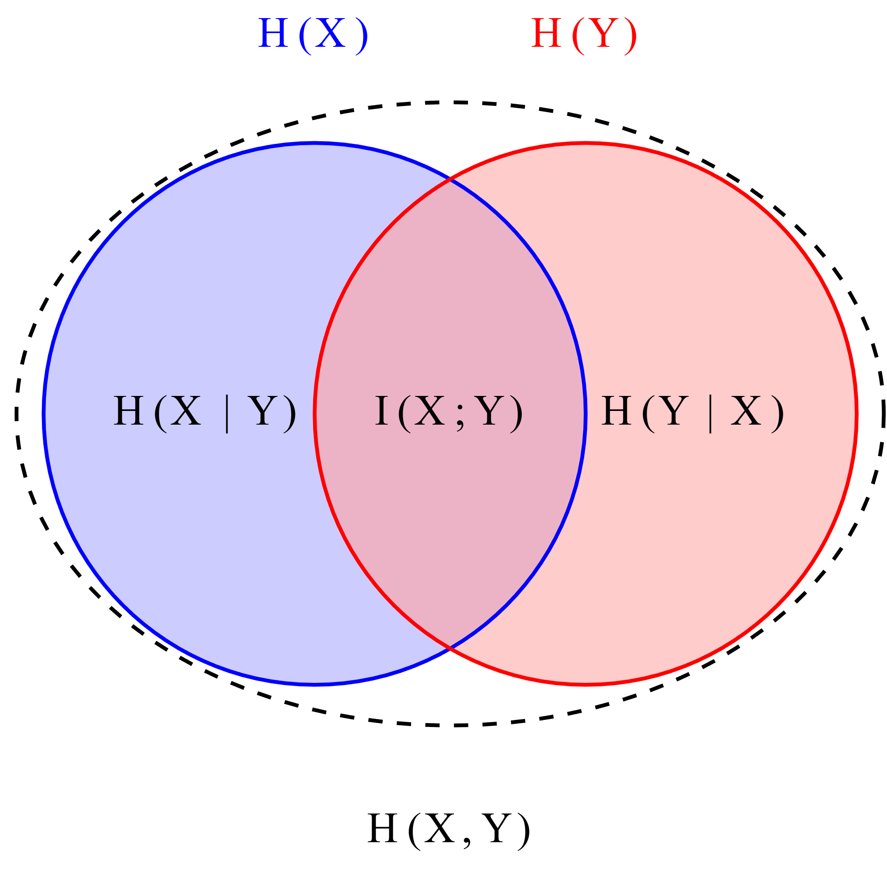

# Entropie et diagrammes de Venn

## Question

Expliquer les propriétés de l'entropie à l'aide des exemples de l'entropie conditionnelle H(X|Y) et de l'entropie jointe H(X,Y).

Utiliser des diagrammes de Venn.

## Introduction aux concepts de base

Avant d'aborder les propriétés, rappelons les définitions essentielles illustrées par le diagramme de Venn suivant :

**Légende :**

- **H(X)** : Entropie de X (incertitude totale sur X)
- **H(Y)** : Entropie de Y (incertitude totale sur Y)
- **H(X,Y)** : Entropie jointe (incertitude totale du couple (X,Y))
- **H(X|Y)** : Entropie conditionnelle (incertitude restante sur X quand on connaît Y)
- **H(Y|X)** : Entropie conditionnelle (incertitude restante sur Y quand on connaît X)
- **I(X;Y)** : Information mutuelle (information partagée entre X et Y)

## Propriétés fondamentales illustrées

### 1. La conditionnement réduit l'entropie
**Propriété :** $H(X|Y) \leq H(X)$

**Explication intuitive :** Connaître Y réduit (ou au pire ne change pas) l'incertitude sur X.

**Illustration :** Dans le diagramme, $H(X|Y)$ est la partie du cercle H(X) qui n'intersecte pas H(Y). Cette région est toujours plus petite ou égale à H(X) tout entier.

**Cas extrêmes :**

- Si X et Y sont indépendants : $H(X|Y) = H(X)$ (les cercles sont disjoints)
- Si Y détermine complètement X : $H(X|Y) = 0$ (les cercles se superposent)

### 2. L'entropie jointe comme union des incertitudes
**Propriété :** $H(X,Y) = H(X) + H(Y|X) = H(Y) + H(X|Y)$

**Explication intuitive :** L'incertitude totale sur le couple (X,Y) équivaut à l'incertitude sur X plus l'incertitude restante sur Y une fois X connu (ou vice-versa).

**Formule visuelle :** 

- $H(X,Y)$ = toute l'aire des deux cercles combinés
- $H(X) + H(Y|X)$ = cercle H(X complet + partie de H(Y) non couverte par X

### 3. Sous-additivité de l'entropie jointe
**Propriété :** $H(X,Y) \leq H(X) + H(Y)$

**Explication intuitive :** L'incertitude totale sur (X,Y) ne peut pas dépasser la somme des incertitudes individuelles, sauf si X et Y sont indépendants (auquel cas c'est égal).

**Illustration :** L'aire d'unification de deux cercles est toujours ≤ à la somme des aires individuelles. L'égalité ($H(X,Y) = H(X) + H(Y)$) se produit quand les cercles sont disjoints (X et Y indépendants).

### 4. Relation triangulaire entre les mesures
**Propriété :** $H(X,Y) = H(X) + H(Y) - I(X;Y)$

**Explication intuitive :** L'entropie jointe est la somme des entropies individuelles moins ce qu'elles partagent en commun (pour ne pas compter deux fois l'information partagée).

**Analogie ensembliste :** Comme en théorie des ensembles : |A ∪ B| = |A| + |B| - |A ∩ B|

### 5. La chaîne des conditionnements successifs
**Propriété :** $H(X|Y) \geq H(X|Y,Z)$

**Explication intuitive :** Plus on a d'information (en conditionnant par plus de variables), plus l'incertitude restante diminue.

**Illustration étendue :** Si on ajoute un troisième cercle Z au diagramme, la région correspondant à $H(X|Y,Z)$ est plus petite que $H(X|Y)$.

## Exemple concret avec un diagramme quantitatif

Considérons deux variables binaires X et Y avec la distribution jointe suivante :

| X | Y | P(X,Y) |
|---|---|--------|
| 0 | 0 | 0.4    |
| 0 | 1 | 0.1    |
| 1 | 0 | 0.2    |
| 1 | 1 | 0.3    |

Calculons les valeurs :

- $H(X) ≈ 0.971$ bits
- $H(Y) ≈ 0.881$ bits
- $H(X,Y) ≈ 1.846$ bits
- $H(X|Y) = H(X,Y) - H(Y) ≈ 0.965$ bits
- $I(X;Y) = H(X) - H(X|Y) ≈ 0.006$ bits (faible dépendance)

**Observations sur cet exemple :**

1. $H(X|Y) = 0.965 < H(X) = 0.971$ : le conditionnement réduit légèrement l'entropie
2. $H(X,Y) = 1.846 < H(X) + H(Y) = 1.852$ : légère sous-additivité
3. $I(X;Y)$ est très petit : les variables sont presque indépendantes

## Applications pratiques en data science

### 1. Compression de données

- $H(X|Y)$ représente la partie de X qui ne peut pas être prédite à partir de Y
- Dans la compression avec side information, on ne code que $H(X|Y)$ au lieu de $H(X)$
- Exemple : compression stéréo où un canal peut être partiellement prédit à partir de l'autre

### 2. Apprentissage automatique

- Si $H(X|Y)$ est faible, alors Y est un bon prédicteur de X
- La réduction $H(X) - H(X|Y) = I(X;Y)$ mesure l'information que Y apporte sur X
- En sélection de caractéristiques : on choisit les Y qui minimisent $H(X|Y)$

### 3. Traitement du signal

- Dans un système de communication, $H(X|Y)$ représente l'incertitude restante après réception
- Si le canal est bruité, $H(X|Y) > 0$ : il reste de l'incertitude
- Un canal parfait aurait $H(X|Y) = 0$

## Synthèse des propriétés clés

| Propriété | Formule | Interprétation visuelle | Condition d'égalité |
|-----------|---------|------------------------|---------------------|
| Conditionnement réduit | $H(X\|Y) \leq H(X)$ | Partie de H(X) hors intersection | X et Y indépendants |
| Entropie jointe additive | $H(X,Y) = H(X) + H(Y\|X)$ | Union = premier cercle + partie exclusive du second | Toujours vraie |
| Sous-additivité | $H(X,Y) \leq H(X) + H(Y)$ | Union ≤ somme des cercles | X et Y indépendants |
| Information mutuelle | $I(X;Y) = H(X) - H(X\|Y)$ | Intersection des cercles | X et Y indépendants ⇒ I=0 |

## Conclusion pédagogique

Les propriétés de l'entropie conditionnelle et jointe peuvent se résumer par une intuition géométrique simple :

- **H(X)** est un cercle représentant l'incertitude sur X
- **H(Y)** est un autre cercle
- **H(X|Y)** est ce qui reste du cercle X quand on retire l'intersection avec Y
- **H(X,Y)** est l'ensemble des deux cercles
- **I(X;Y)** est la zone de chevauchement

Cette visualisation explique pourquoi :

1. Connaître Y ne peut qu'aider à réduire l'incertitude sur X (jamais l'augmenter)
2. L'incertitude sur (X,Y) est au plus la somme des incertitudes individuelles
3. L'information partagée est ce qui "économise" des bits en codage joint

Ces principes fondamentaux sont à la base de la compression de données, de l'apprentissage automatique et des communications numériques.